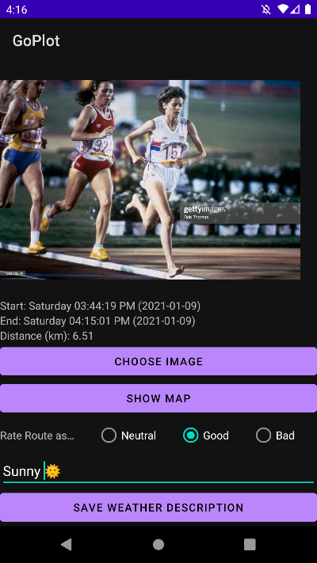

# Repository Contents

Open this repository in Android Studio or install GoPlot.apk on an Android device.

# Overview and Justifications

Most Activities have associated ViewModels, which contain instances of data access objects (DAOs) relevant to the user's current task. Data fields are bound to `LiveData` objects, allowing the information they contain to be updated efficiently, especially when it changes frequently. The ViewModels maintain singleton instances of `GoogleMap` objects for layouts containing `MapFragment`. This is an improvement according to the MVVM pattern over the default situation in which the Activity is responsible for these instances. Where appropriate, user interaction is handled directly by the ViewModel through lambda expressions bound in `android:onClick` , further reducing code in Activities.

Two-way data-binding allows user input to dynamically update other Views, for example: as the user types a new goal, their progress towards that goal is updated immediately in a progress bar. Users may appreciate "instant feedback" more than the "submit form to update" paradigm.

To receive location updates, a "foregrounded" Service is started to ensure that the recoding of a Route is never interrupted by the OS. To separate concerns, the updates are processed by an associated ViewModel.

When the battery is low, a `BroadcastReceiver` turns down the frequency of location updates. This is one of the few cases in which a `BroadcastReceiver` can be justifiably used in modern Android development since it is the only way to learn about changes in battery life.

All data operations are performed with Room internally but CRUD operations are available through a `ContentProvider` to external clients.

# Explanations of Features and Architecture

The major features can be organised according to how they complete the phrase, "I would like to..." and are accessible through corresponding buttons in `MainActivity`. Each feature is discussed below, with the addition of "Show a Single Route", which is encountered when the user taps on a Route in any `RecyclerView`.

## Record a new Route

The map is centred on the user's location while `RecordRouteActivity` loads. Upon tapping "START", `RecordRouteService` is started and bound in the "foreground" with the Action `START_RECORDING`. In the non-dismissible notification, the user can tap "Cancel Recording" to stop the Service with the Action, `STOP_RECORDING`, causing the ViewModel to not save that Route. The UI is reset and the user can seamlessly start recording a new Route or exit the app, thus allowing total control over privacy and security. By tapping anywhere else in the notification, the user is brought back to the same instance of `RecordRouteActivity` because `android:launchMode` is set to `singleTop`.

The `LocationRequest` object is initialised to receive updates at a default interval. A `BroadcastReceiver` is defined inside `RecordRouteService` and contextually registered upon creation. It halves the request interval if it receives the `Intent.ACTION_BATTERY_LOW` broadcast.

`RecordRouteActivity` is registered in `RecordRouteService`'s remote call back list and receives a `LocationResult` every time the `FusedLocationProviderClient` provides one; passing the `Location` object to `RecordRouteViewModel` via a lambda for processing. This information flow is necessary because of the relationship between Activities and Services. The fields which display the metrics of the recording are bound to `LiveData` in the ViewModel, which recalculates their values after it receives a new `Location`. Tapping "PLACE MARKER" sets a Boolean flag to true for the Spot object corresponding to the user's current location. Tapping "STOP" unbinds the Service and sets its Action to `STOP_RECORDING` while the ViewModel creates a new Route object and its constituent Spot objects, inserting them all into the database via Room. Finally, `ListRoutesActivity` is started - the new Route can be seen at the top of its `RecyclerView`.

## List all Routes

A `RecyclerView` is initialised which observes the `LiveData<List<Route>>` from `ListRoutesViewModel`, populating `ListViewAdapter` which can start `SingleRouteActivity` through its `OnClickListener` with the Route ID of the user's tapped Route added to the Intent.

## Show a Single Route

`SingleRouteActivity` passes the Route ID from its Intent to `SingleRouteViewModel` which retrieves the corresponding object from Room. This object's fields' values are posted to the `MutableLiveData` which are bound in the layout's XML to display the metrics of the Route in a database executor thread. This is a good design choice as it frees the threads of the Activity and the ViewModel from being slowed down by this operation.

Tapping "CHOOSE IMAGE" creates an Implicit Intent for an image and passes the resulting URI to the ViewModel which saves the Route's URI field in the database and posts the value of the decoded bitmap stream so that its binding `ImageView` can display it. For this, a custom `BindingAdapter` is written since there is no built-in functionality to load an object of type `LiveData<Bitmap` into an `ImageView`. 

Tapping "SHOW MAP" starts `MapsActivity` with the Route ID in its Intent. Note that this is the first of two uses of `MapsActivity` and `MapsViewModel` depending on whether a Route ID is present in the Intent; the second is discussed in the "Show all Markers" section below.

Interaction with the `RadioButtons` updates the Route's rating and is handled by a bound ViewModel method where its representation is as a Boolean array: each element indicates whether its corresponding button is enabled. Since it uses `LiveData`, the database is updated every time the user changes the rating, instead of the traditional pressing of a "Save" button.

In contrast, the weather description ("Sunny ☀️" in the screenshot) is kept in an `ObservableField` whose value is only accessed when the user taps the "SAVE WEATHER DESCRIPTION" button to update the Route object and send those changes to the database. It is inefficient to update the database for every character the user types but only when they explicitly indicate that they have finished typing the entire description. It also enhances privacy as we should not save all characters that a user types in a "draft" but only the "final" version since we are not providing an "auto-save" feature for such a small piece of text.

## Show all Markers

The first screenshot shows the first use of `MapsActivity`: to show all the Marked Spots from all Routes on the device - it is accessed by tapping "SHOW ALL MARKERS" in `MainActivity`. If `MapsActivity` is created with a Route ID in its Intent, it observes the method in `MapsViewModel` which provides all the Marked Spots. The second screenshot shows a single Route, accessed when the user taps "SHOW MAP" from `SingleRouteActivity`. Since this causes it to launch with a Route ID, `MapsActivity` observes the method in `MapsViewModel` which provides the single Route's Polyline and Marked Spots.

## Analyse Statistics

Each `RecyclerView` is populated by specialised `RouteDao` queries of each metric, limited to the top three results. `AnalyseStatisticsActivity` defines an `Observer<List<Route>>` which waits on the asynchronous call to receive the Routes because the library `com.github.mikephil.charting` requires a synchronous list of data to populate the graph. Each bar in the graph is a sum of the distances for all Routes that day and thus answers the question, "How far have I run so far today?". This being displayed for all days in the current week and the ability to compare top Routes of all time in each `RecyclerView` helps to answer the questions, "How much have I improved?" and "Have I run faster than my best time today?".

## Track Goals

`TrackGoalsActivity` does nothing other than connect to `TrackGoalsViewModel` and set up Data Binding. The ViewModel instantiates a reference to its inner class extension of `BaseObservable` to notify of the goal's `EditText` changing so that the `MutableLiveData` which fills the progress bar can be posted with its new value. The user's goals are stored in the app's `SharedPreferences`, an instance of which is maintained in `TrackGoalsViewModel` and updated by the Observable inner class's setter. Each `EditText` uses two-way data binding so that their values can be used as the user updates them. Each `TextView` uses standard data binding to display the formatted Strings of the current distance values.

# ContentProvider

The functionality of `GoPlotContentProvider` is defined in `GoPlotContract`. Note that `GoPlot` does not use Cursors internally. Inserting a new Route or Spot requires certain fields which their constructors expect. Updating a Route or Spot allows giving any combination of fields as they are only overwritten in the database when specified. The rationale here is that any field(s) should be editable on any record without having to re-specify field(s) that should not be changed. Both operations involve extracting the data from `ContentValues` objects.

# Testing

The following tests are included in the project:
 - Espresso UI instrumentation tests
 - Standard JUnit tests
 - Robolectric unit tests to mock Android classes